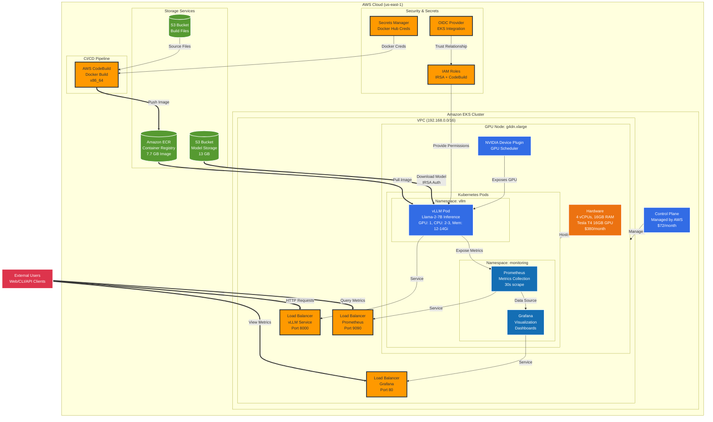
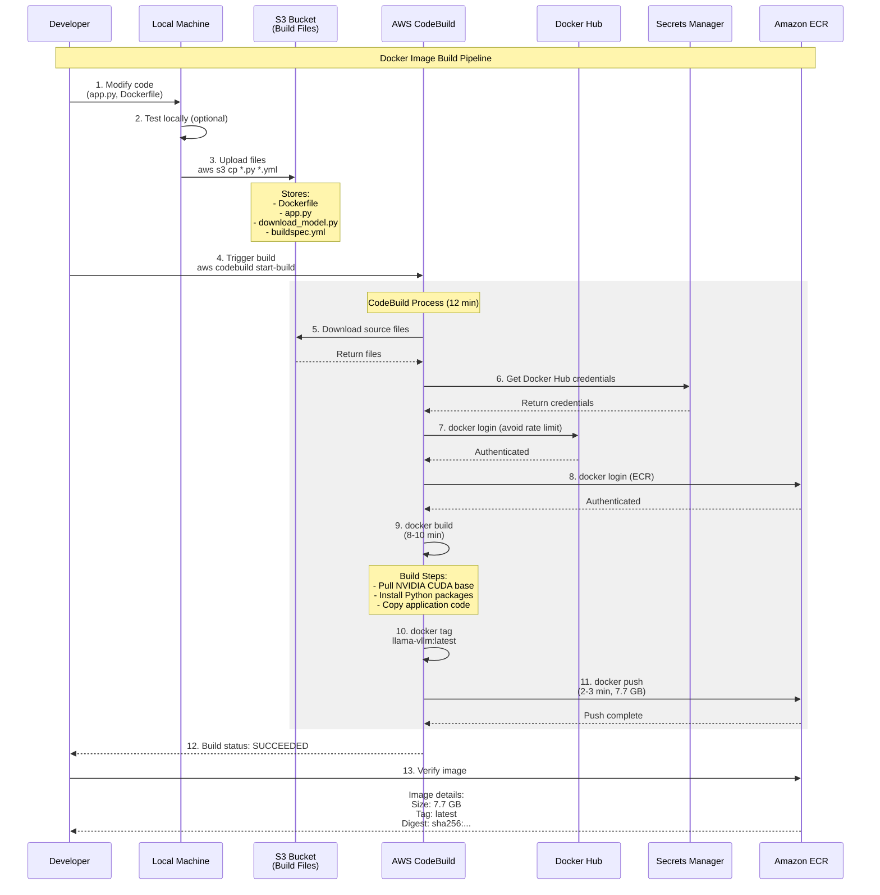
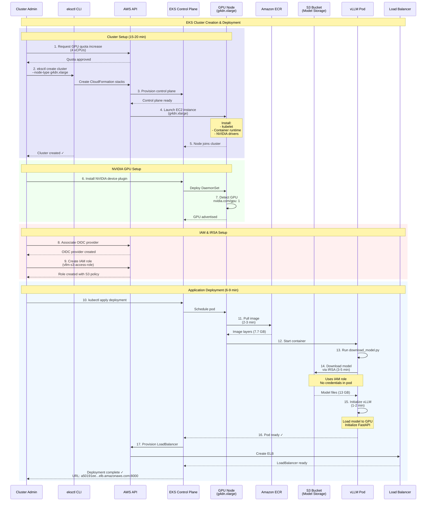
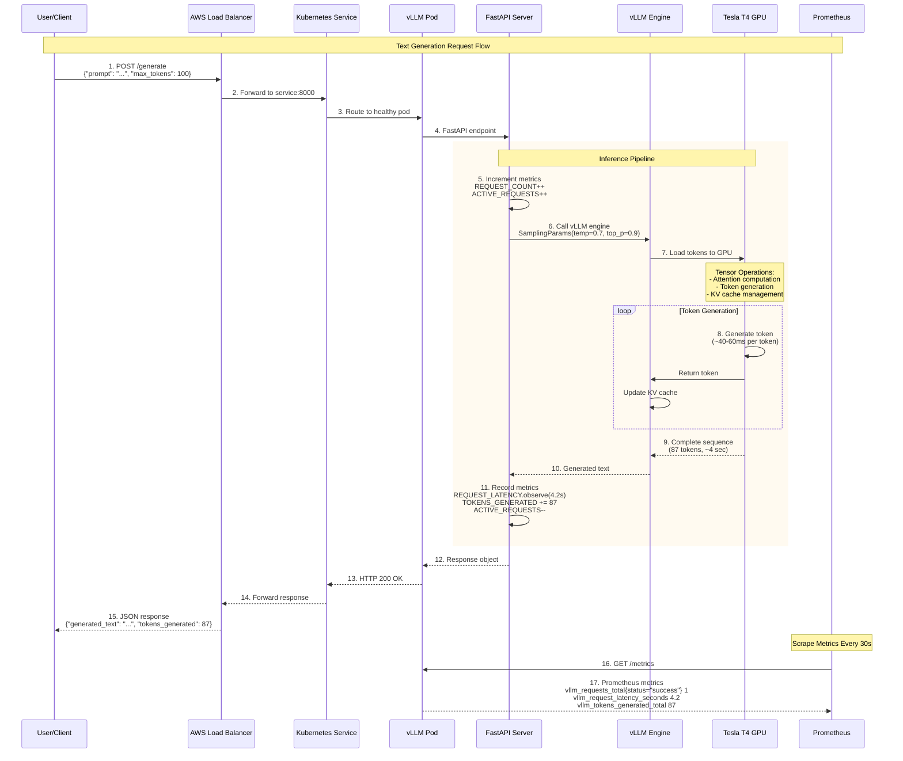
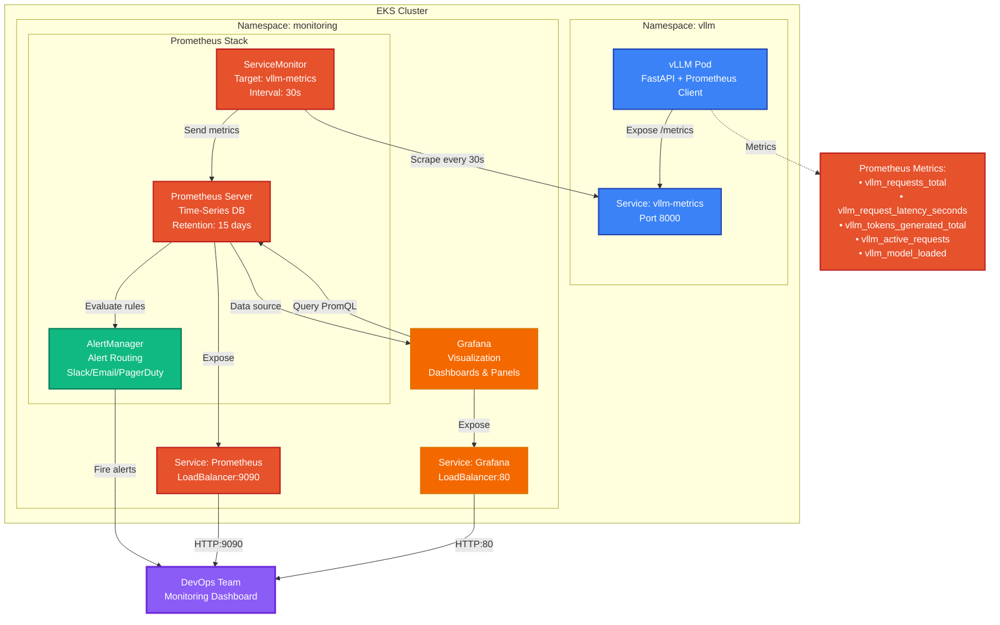
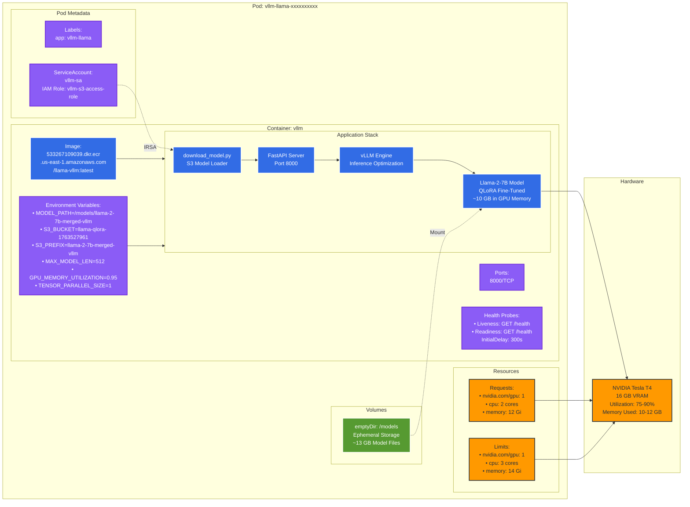

## 1. High-Level AWS Infrastructure Overview

## 2. Docker Build & ECR Pipeline Flow

## 3. EKS Cluster & Pod Deployment Flow

## 4. Model Inference Request Flow

## 5. Monitoring Stack Architecture

## 6.Detailed pod Architecture

## 7.Complete Data Flow Timeline

```mermaid
gantt
    title vLLM Deployment Timeline (Cold Start)
    dateFormat X
    axisFormat %M:%S
    
    section Build Phase
    Upload to S3           :done, s1, 0, 30s
    CodeBuild Queue        :done, s2, after s1, 30s
    Docker Build           :done, s3, after s2, 600s
    Push to ECR            :done, s4, after s3, 180s
    
    section Cluster Setup
    Request GPU Quota      :done, c1, 0, 1800s
    eksctl Create Cluster  :done, c2, after c1, 1200s
    Install NVIDIA Plugin  :done, c3, after c2, 60s
    Configure IRSA         :done, c4, after c3, 120s
    
    section Deployment
    Apply Manifests        :active, d1, after c4, 10s
    Schedule Pod           :active, d2, after d1, 30s
    Pull Image from ECR    :active, d3, after d2, 180s
    Download Model from S3 :active, d4, after d3, 300s
    Initialize vLLM        :active, d5, after d4, 120s
    Server Ready           :milestone, after d5, 0
    
    section First Request
    User Request           :crit, r1, after d5, 5s
    Generate Response      :crit, r2, after r1, 4s
    Return to User         :milestone, after r2, 0
```

## 8. Benchmarked vLLM Metrics Overview

```mermaid
graph TB
    %% Styling
    classDef latencyNode fill:#3b82f6,stroke:#1e40af,stroke-width:2px,color:#fff
    classDef throughputNode fill:#10b981,stroke:#047857,stroke-width:2px,color:#fff
    classDef resourceNode fill:#f59e0b,stroke:#d97706,stroke-width:2px,color:#fff
    classDef qualityNode fill:#8b5cf6,stroke:#6d28d9,stroke-width:2px,color:#fff
    
    BENCH[vLLM Benchmark<br/>g4dn.xlarge + Tesla T4]
    
    BENCH --> LATENCY[Latency Metrics]:::latencyNode
    BENCH --> THROUGHPUT[Throughput Metrics]:::throughputNode
    BENCH --> RESOURCES[Resource Utilization]:::resourceNode
    BENCH --> QUALITY[Quality Metrics]:::qualityNode
    
    LATENCY --> L1[Time to First Token<br/>TTFT: 100-200ms]:::latencyNode
    LATENCY --> L2[Per Token Latency<br/>40-60ms/token]:::latencyNode
    LATENCY --> L3[Total Request Time<br/>4-6 sec for 100 tokens]:::latencyNode
    LATENCY --> L4[P50 Latency: 200ms<br/>P95 Latency: 500ms<br/>P99 Latency: 2.3s]:::latencyNode
    
    THROUGHPUT --> T1[Tokens per Second<br/>15-25 tok/s]:::throughputNode
    THROUGHPUT --> T2[Requests per Second<br/>0.3-0.5 req/s]:::throughputNode
    THROUGHPUT --> T3[Concurrent Requests<br/>Max: 2-4]:::throughputNode
    THROUGHPUT --> T4[Batch Size<br/>8-16 concurrent]:::throughputNode
    
    RESOURCES --> R1[GPU Utilization<br/>70-90%]:::resourceNode
    RESOURCES --> R2[GPU Memory<br/>10-12 GB / 16 GB]:::resourceNode
    RESOURCES --> R3[CPU Usage<br/>1.5-2.5 cores / 4]:::resourceNode
    RESOURCES --> R4[RAM Usage<br/>8-10 GB / 16 GB]:::resourceNode
    
    QUALITY --> Q1[Context Window<br/>512 tokens]:::qualityNode
    QUALITY --> Q2[Model Size<br/>7B parameters, 4-bit]:::qualityNode
    QUALITY --> Q3[Cold Start<br/>6-9 minutes]:::qualityNode
    QUALITY --> Q4[Warm Inference<br/>~10 seconds]:::qualityNode
```

